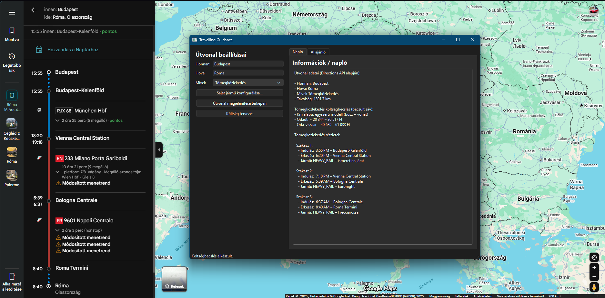

# ✈️ Travelling Guidance  
**Python utazástervező alkalmazás beépített AI ajánlóval**

A Travelling Guidance egy grafikus útvonaltervező alkalmazás, amely  
Google Maps alapú útvonaladatokat (távolság, utazási idő, költségbecslés)  
kombinál egy AI által támogatott úti cél ajánlóval.

A projekt célja egy könnyen használható, demonstrálható és bővíthető  
utazástervező rendszer létrehozása.

⚠️ A projekt nem tartalmazza az API kulcsokat az alkalmazáshoz! ⚠️

Ezeket vagy környezeti változóba kell tárolni/Huggingface Token kulcsot kézzel kell beírni.

---

##  Fő funkciók

### 🔹 **1. Útvonal megjelenítése Google Maps-ben**
A felhasználó megadja:
- Honnan
- Hová
- Mivel (Autó, Tömegközlekedés, Repülő)

A program ezután:
- megnyitja az útvonalat a Google Maps-ben,
- lekéri a részletes adatokat a Google Directions API-ból (távolság, idő, figyelmeztetések).

---

### 🔹 **2. Költségtervezés**
A program költséget számol az utazási mód alapján:

#### 🚗 Autó
- felhasználó által konfigurált autó (fogyasztás, üzemanyagár)
- becsült üzemanyagköltség kiszámítása

#### 🚌 Tömegközlekedés
- egyszerű km-alapú ármodell
- a Google API-ból kinyert tranzit szakaszok megjelenítése (busz/vonat járatok, indulási és érkezési helyek)

#### ✈️ Repülő
- távolságon alapuló becsült jegyár (oda / oda-vissza)

---

### 🔹 **3. AI úti cél ajánló (HuggingFace API)**
A beépített AI képes:

- felhasználói szöveges kérés alapján úti célokat ajánlani  
  (pl. *„északi ország, drónozásra alkalmas tájak, ne legyen túl hideg”*)
- teljes, formázott válasz megjelenítése a külön AI fülön

A modell távoli API-n fut, így nincs szükség lokális GPU-ra.  
A token programból állítható, nem kerül mentésre.

---

## Felület

